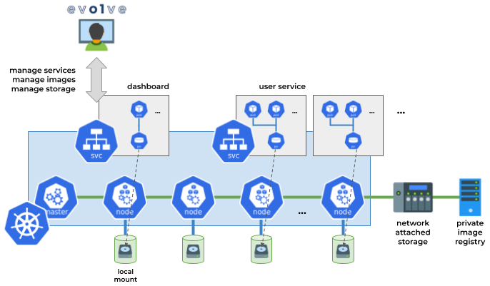

Technical notes
===============

Storage management
------------------

In a cluster environment, it is common for each user to have a "home folder", usually mounted over NFS, Lustre, Gluster, etc. Knot tries to apply this notion in a containerized environment: Given a cluster-wide shared folder, this folder is also mounted inside containers as well. Thus, when running a notebook server (like JupyterHub), user data is available in the containerized environment at a well-known path - as it would be in a bare-metal cluster node. This, in addition to the web-based file browser provided by Knot, facilitates easy data management for applications, both for providing inputs and collecting outputs.

In Knot, there are two such folders/data domains for all users (and an additional for admins used for customizing service templates and the interface theme, as mentioned in the following paragraphs):

- Private: User data that is private to the user. Mounted in containers under `/files/private`.
- Shared: Data that is shared among all users. Mounted in containers under `/files/shared`.

For the first domain Knot creates a subfolder for each user, named after the corresponding username and only allows access within that subfolder (like a "home folder"). This is hidden to the user, meaning that `/files/private` is the user subfolder itself. Users cannot go up a level and check other users' names and files.



*The dashboard runs as a service in Kubernetes and coordinates the execution of other services in particular namespaces. All provisioned containers of a user share common volumes.*

To attach these data folders to service and application containers, Knot creates Persistent Volumes and associated Persistent Volume Claims for each user, and provides a Kubernetes mutating admission webhook which intercepts all calls to create pods or deployments and injects the appropriate volumes to respective configurations before they are applied. The Knot service itself also has the same data folders mounted in order to present their contents via the dashboard.

Service templates
-----------------

Knot provides a way for users to easily configure and start services, by integrating a service templating mechanism based on [Helm](https://helm.sh). Helm service templates, named "charts", are packaged and placed within an artifact registry, like [Harbor](https://goharbor.io). The list of available services includes global and user-specific charts, which are automatically discovered by Knot.

When deploying a service, the user can specify chart values through the dashboard. Knot will silently set "internal" platform configuration values (in the `knot` namespace), such as the generated hostname assigned to the service, the location of the private container registry, etc.

Knot-compatible charts may use the following values:

| Value                     | Description                                                                             | Set in env.
| ------------------------- | --------------------------------------------------------------------------------------- | -----------
| `knot.enabled`            | Set to `true`                                                                           |
| `knot.hostname`           | The hostname assigned to the service (set to `<release name>-<username>.<ingress url>`) |
| `knot.username`           | The user's username                                                                     | ✓
| `knot.namespace`          | The user's namespace                                                                    | ✓
| `knot.ingressUrl`         | The dashboard's URL                                                                     | ✓
| `knot.privateDir`         | The path to the "private" data domain                                                   | ✓
| `knot.privateVolume`      | The volume used for the "private" data domain                                           | ✓
| `knot.sharedDir`          | The path to the "shared" data domain                                                    | ✓
| `knot.sharedVolume`       | The volume used for the "shared" data domain                                            | ✓
| `knot.argoWorkflowsUrl`   | The URL of the Argo Worfklows service (set if Argo Workflows is enabled)                | ✓
| `knot.privateRegistryUrl` | The URL of the "private" container registry (set if Harbor is enabled)                  | ✓
| `knot.publicRegistryUrl`  | The URL of the "shared" container registry (set if Harbor is enabled)                   | ✓
| `knot.privateRepoUrl`     | The URL of the "private" Helm chart repository (set if Harbor is enabled)               | ✓
| `knot.publicRepoUrl`      | The URL of the "shared" Helm chart repository (set if Harbor is enabled)                | ✓

As shown in the table, some values are also set inside pods as environment variables (in uppercase snake case, i.e. `KNOT_PRIVATE_DIR`).

Inline comments for variables in `values.yaml` are shown as help text to the user. You can also use `knot.metadata` to specify elaborate help messages or specific variable choices. For example, the following excerpt from `values.yaml` hides variable `image`, sets the title and help text for variable `message`, and defines preselected choices for `version`:

```
knot:
  enabled: true
  hostname: service.example.com
  metadata:
    image:
      hidden: true
    message:
      title: Display message
      help: Choose a descriptive message
    version:
      help: Select version
      choices:
      - "1.0"
      - "2.0"
```

Knot will show all services to the user, except those marked with the label `knot-hidden`. Upon deployment, Knot will attach local storage folders to all pods. Authentication directives are added to all ingress resources (except on those labelled with `knot-no-auth`).

User namespaces
---------------

Internally, at the Kubernetes level, each Knot user is matched to a unique namespace, which also hosts all of the user's services. Containers launched within the namespace are given Kubernetes service accounts which are only allowed to operate within their own namespace. This practice organizes resources per user and isolates users from each other.

Users may also form teams. Internally, each team is just another Knot user. When a user selects to switch to a team's profile, the user actually impersonates the team user. Administrators are not given the option to switch between different profiles, as they can impersonate any user.

For user "test", Knot creates the namespace `knot-test` and binds the `default` user account in that namespace to the `cluster-admin` cluster role (only for the `knot-test` namespace).

Service exposure
----------------

To expose services to the user, Knot makes use of a Kubernetes ingress - a proxy server. Service templates that provide a user-facing service include an ingress directive. Knot effectively:

- Exposes all services on subdomains of the main dashboard domain (unless specific URL prefixes have been set up on installation). These domains are composed of the service name and the username, so they can always be the same, allowing the user to bookmark the location.
- Protects all services with an authentication/authorization mechanism, by configuring each respective ingress to perform single sing-on through the dashboard. The default deployment integrates [Vouch Proxy](https://github.com/vouch/vouch-proxy) as an OAuth 2.0/OIDC client to the dashboard, which in turn provides credentials to the NGINX-based web proxy implementing the ingress. Thus, each service can only be accessed by its owner. This helps avoiding any external party visiting a user's service frontend without appropriate credentials.
- Incorporates all services under a common SSL environment, so all data sent back-and-forth through each ingress is encrypted.

Assuming that the dashboard is accessible at `example.com`, the "File Browser" service named `browser` started by user "test" will be exposed at `browser-test.example.com`. Knot will also inject appropriate rules to the service's ingress configuration, so that no other user can access `browser-test.example.com`. As the ingress will be configured with an SSL certificate for both `example.com` and `*.example.com`, all connections will be SSL terminated.

Single sign-on service
----------------------

Knot implements an OAuth 2.0/OIDC provider, which allows third-party services to request verification of users' identities via standard protocols. In the OIDC response, Knot also sets extra data that may be useful to connected services (all environment variables mentioned in [Service templates](#service-templates), but in lowercase, i.e. `knot_private_dir`).

Note that OAuth 2.0/OIDC provides only authentication information and it is up to the connecting service to define what users are authorized to do, based on their identities (i.e., username, email, etc.). In addition to the integration with Vouch Proxy for authenticating users to services started by the dashboard, Knot also acts as an identity provider to [JupyterHub](https://jupyter.org/hub), [Argo Workflows](https://argoproj.github.io/workflows), [Harbor](https://goharbor.io), [Gitea](https://gitea.com), and other services that may be installed side-by-side to the dashboard. For compatible services, Knot also configures user authorization to resources. For example, in Argo Workflows, Knot sets the appropriate role bindings so that users will only be allowed to access workflows in their respective Knot-defined namespaces.

Interface customization
-----------------------

The default theme used for the interface is stored in the `theme` folder within the admin file domain (available via Knot's web-based file browser and mounted at `/files/admin` for admin users). The theme is initialized to default values on startup if the `theme` folder does not exist.

The theme consists of the following files, which can be customized to change the look and feel of the interface:

- `logo.png`: The logo shown at the login screen and at the top-left of the menu.
- `style.css`: Custom CSS styling for various interface elements.
- `menu_pre.html`: Inserted verbatim at the top of the menu (included by `dashboard/templates/dashboard/main.html`).
- `menu_post.html`: Inserted verbatim at the bottom of the menu (included by `dashboard/templates/dashboard/main.html`).
