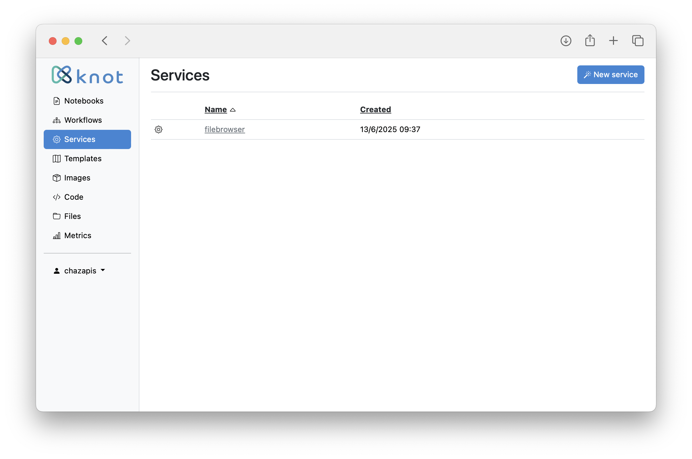
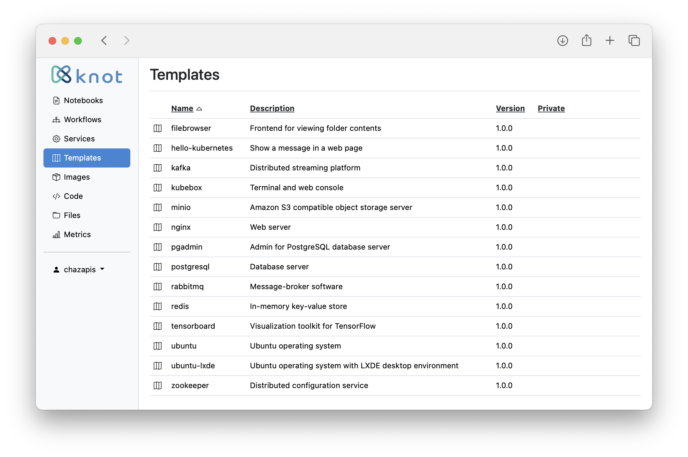
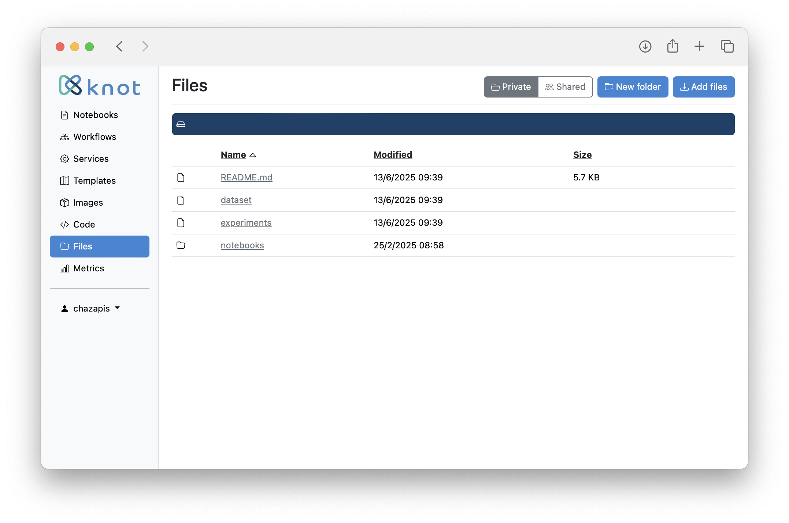

User guide
==========

This guide walks you through the various Knot screens, starting from user sign up, explaining the available functions.

Sign up and login
-----------------

When you visit the dashboard service with your browser, you are greeted with the login screen.

To create an account, select the "Sign up" option on the main screen and fill in a username, password, and contact email.

Once the account is activated by an administrator, login using your username and password. You can change your password when logged in by clicking on the user icon at the top-right of the screen and selecting "Change password" from the menu. The menu also provides options to switch between profiles (if you are a member of one or more teams), view previous messages reported, access this documentation, and logout. If you ever forget your password, please ask an administrator to reset it.

Notebooks, workflows, images, and metrics buttons
-------------------------------------------------

Selecting "Notebooks" from the menu on the left will redirect you to JupyterHub. JupyterHub will automatically launch a new server instance for you, if one is not already running. Your notebooks are saved in `/private/notebooks`, so you can also access them as files from the dashboard. You can stop your server instance by clicking on the "Control Panel" button on the top-right of the screen.

Selecting "Workflows" from the menu on the left will redirect you to Argo Workflows. The first time you open up the Argo interface, it will ask you to login. Just click on the "Login" button, as single sign-on is already set up. You should then be redirected to your workflows page, with the namespace set to `knot-<username>`.

Selecting "Images" from the menu on the left will redirect you to Harbor. Click on "Login via OIDC provider" for single sign-on with your username. Knot will setup a private project for you named after your username. The "library" project is shared among all users. Each project can be used to store container images or Helm charts (used for Knot templates).

Selecting "Metrics" from the menu on the left will redirect you to Grafana. Click on the search icon on the top-left of the screen to get a list of preconfigured metric dashboards.

Services screen
---------------

The services screen is accessed by selecting "Services" from the menu on the left. Clicking on a service name from the list of running services will take you to the service frontend in a new browser tab. Use the "Actions" button to view a service's values, upgrade a service (if a new version of its template exists), or remove it.

To start a new service, click on the respective button on the right. Choose one of the available service templates from the list and click "Create".

The next screen is where you can define service variables. You can optionally change the service name to one that is easier to remember (if a name is already taken, Knot will append random characters). Besides the name, each service template has different variables. When done, click "Create" again, and you will be taken back to the service list. After a few seconds, your new service will appear in the list.

Templates screen
----------------

The templates screen is accessed by selecting "Templates" from the menu on the left. Use the "Actions" button to start a service from the list of available service templates.

New templates are added in Harbor. The template structure is described in the [Service templates](technical-notes.md#service-templates) chapter.

Files screen
------------

The files screen is accessed by selecting "Files" from the menu on the left. Change between "private" and "shared" domains by clicking on the corresponding buttons on the upper-right of the screen. The "private" domain contains private user files, while "shared" is common across all users. Any user can add or remove files in "shared".

Select a folder to navigate into that path (the current path is shown above the list), or a file to download it. Use the "Actions" button to download a folder as an archive or delete an object.

Files are mounted in containers under `/private` and `/shared` respectively.

To add a new folder or upload file(s) at the current path, click on the respective buttons on the right. Note that you can not overwrite an existing folder or file.

> 📝 *The "Files" screen is meant to provide the very basic of file-related operations. Use the notebook environment as you would use a shell on a UNIX-based machine to manage files, or create a "filebrowser" service for a web-based interface.*

Administration
--------------

> 📝 *The information in this section applies only to administrators.*

The "admin" user has access to an additional screen named "Users".

The users screen is accessed by selecting "Users" from the menu on the left. Each user can be "active", meaning with access to the dashboard and services. Each user can also be promoted to an administrator. The respective actions are available in the menu presented when using the "Actions" button. An administrator can edit a user's email, change a user's password, impersonate, and delete a user.

When impersonating another user, the whole interface changes to what the user sees and the user icon at the top-right of the screen darkens to signify "impersonation mode". The user menu provides the option to stop impersonating and return to the original user's view.
