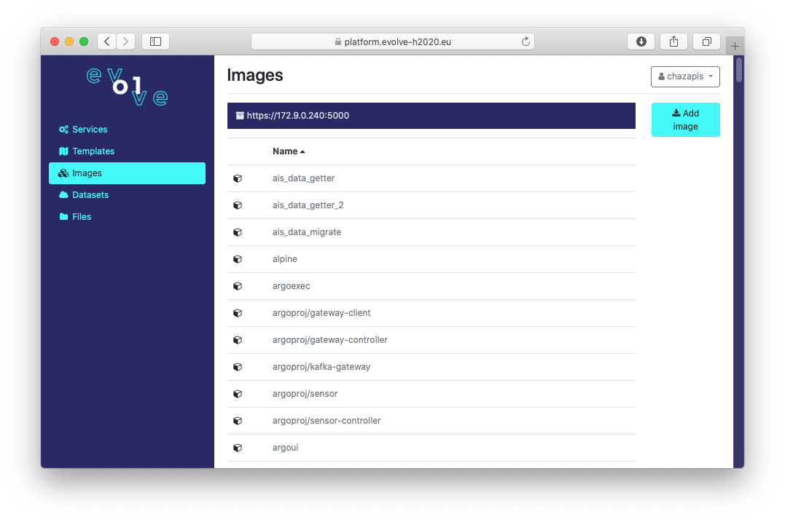
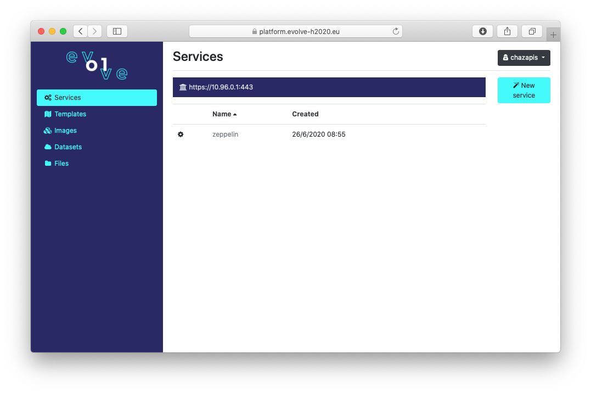

User guide
==========

This guide walks you through the various Karvdash screens, starting from user sign up, explaining the available functions.

Sign up and login
-----------------

When you visit the dashboard service with your browser, you are greeted with the login screen.

.. figure:: images/login-screen.png

To create an account, select the "Sign up" option on the main screen and fill out a username, password, and contact email.

.. figure:: images/sign-up-screen.png

Once the account is activated by an administrator, login using your username and password. You can change your password when logged in by clicking on the user icon at the top-right of the screen and selecting "Change password" from the menu. The menu also provides an option to report an issue and logout. If you ever forget your password, please ask an administrator to reset it.

Services screen
---------------

The services screen is accessed by selecting "Services" from the menu on the left. You are presented with a list of running services. Select a service name and you will be taken to the service frontend in a new browser tab. Select the "Actions" button to remove a service.

.. note::
   The service may take some time to initialize. If you select a service name immediately after creation, you may see a proxy error. Just wait for a few seconds and refresh your browser.

.. figure:: images/services-screen.png

To start a new service, click on the respective button on the right. You will be shown a list of available service templates. Choose one and click "Create".

The next screen is where you can define service variables. You can optionally change the service name to one that is easier to remember (if a name is already taken, Karvdash will append random characters). Besides the name, each service template has different variables. Click "Create" again when done, and you will be taken back to the service list, which should contain your new service (a message on the top of the screen will verify that a new service started and provide its name).

Templates screen
----------------

The templates screen is accessed by selecting "Templates" from the menu on the left. You are presented with a list of available service templates. Select a template to download it in YAML format. Select the “Actions” button to delete a template (only user templates can be deleted) or start a service from it.

.. figure:: images/templates-screen.png

To add a new template, click on the respective button on the right. The template file format is described in the :ref:`Service templates` chapter.

Images screen
-------------

The images screen is accessed by selecting "Images" from the menu on the left. You are presented with a list of container images in the preconfigured private Docker registry. Select an image to view available tags.

To add a new image, click on the respective button on the right. You will be asked to provide a name, tag, and file (exported image) for the new image. Note that you must provide a unique name and tag combination, to avoid overwriting other user's images.

Datasets screen
---------------

The datasets screen is accessed by selecting "Datasets" from the menu on the left. You are presented with a list of configured datasets. Select a dataset to download its configuration in YAML format. Select the “Actions” button to delete a dataset (only user templates can be deleted).

.. figure:: images/templates-screen.png

To add a new dataset, click on the respective button on the right and fill in the fields.

Files screen
------------

The files screen is accessed by selecting "Files" from the menu on the left. You are presented with a list of folder and files in the respective domain. Change domain ("local", "remote", or "shared") by clicking on the corresponding buttons on the upper-right of the screen. "Local" and "remote" domains contain private user files in corresponding storage pools (local to nodes or at a remote share), while "shared" is common accross all users. Any user can add or remove files in "shared".

Select a folder to navigate into that path (the current path is shown above the list), or a file to download it. Select the "Actions" button to download a folder as an archive or delete an object (non-empty folders can not be deleted). Respective actions are also available to upload compatible image files (ending in ``.tar``) and add templates (ending in ``.template.yaml``).

.. figure:: images/files-screen.png

To add a new folder or upload file(s) at the current path, click on the respective buttons on the right. Note that you can not overwrite an existing folder or file.

.. note::
   The "Files" screen is meant to provide the very basic of file-related operations. Use the notebook environment ("Zeppelin" service) as you would use a shell on a UNIX-based machine to control the filesystem in a more elaborate manner.

Administration
--------------

.. note::
   The information in this section applies only to administrators.

The admin user has access to an additional screen named "Users". Moreover, in the "Images" screen, the admin has the option to use the "Actions" button to delete an image and to "garbage collect" the registry.

The users screen is accessed by selecting "Users" from the menu on the left. You are presented with a list of users, by username. Each user can be "active", meaning with access to the dashboard and services. Each user can also be promoted to an "admin". The respective actions are available in the menu presented when selecting the "Actions" button. An administrator can edit any user's email, change passwords, impersonate, and delete users.

.. figure:: images/users-screen.png

When impersonating another user, the whole interface changes to what the user sees and the user icon at the top-right of the screen darkens to signify "impersonation mode". The user menu provides the option to stop impersonating and return to the original user's view.

