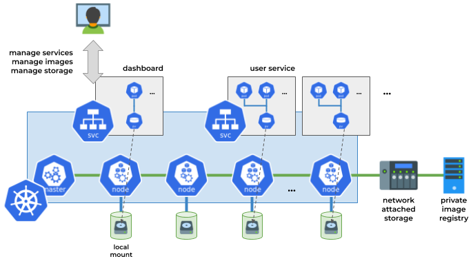

User guide
==========

Karvdash (Kubernetes CARV dashboard) is a service management software for Kubernetes, which runs in Kubernetes as a service itself.

Karvdash provides:

* H web-based graphical frontend - a `dashboard` to:

  * Manage services or applications that run in Kubernetes.
  * Manage container images stored in a private Docker registry.
  * Manage collections of data that are automatically attached to service and application containers when launched.

* A method to launch services or applications from templates that support setting variables before launch.
* An easy an automated way to isolate services in different Kubernetes namespaces depending on the Karvdash user they belong to.
* An integrated solution to securely provision multiple services under one network address and port.

Kubernetes provides all the tools to do data sharing, create namespaces, etc., but the exact implementation and structure of the overall environment is left to the developer. By making respective choices and following a particular workflow, Karvdash practically imposes a Kubernetes usage methodology, which by design has been tailored to a specific environment (HPC cluster) and type of users (data scientists).

Karvdash also implements a "traditional" user scheme (and all associated mechanisms) which is then mapped to Kubernetes namespaces and service accounts. Kubernetes does not have "users" and no place to "login into", as expected by most high-level platform users.

This guide first provides a brief technical overview of Karvdash, and then walks you through the various screens, starting from user sign up, explaining the available functions.

Technical overview
------------------

In a cluster environment, it is common for each user to have a "home folder", usually mounted over NFS. Karvdash tries to apply this notion in a containerized environment: All cluster nodes share a common NFS folder, but this folder is also mounted inside containers as well. Thus, when running a notebook server (like Zeppelin or Jupyter), user data is available in the containerized environment at a well-known path - as it would be in a bare-metal cluster node. This, in addition to the web-based file browser provided by Karvdash, facilitates easy data management for applications, both for providing inputs and collecting outputs.

In Karvdash, there are three such folders/data domains:

* Local: User data that is stored on the cluster nodes themselves via a distibuted filesystem. Mounted in containers under ``/local``.
* Remote: User data that is stored on a separate storage device and shared via a network link. Mounted in containers under ``/remote``.
* Shared: Data that is shared among all users (usually stored on the same device providing "remote" storage). Mounted in containers under ``/shared``.

For the first two domains ("local" and "remote") Karvdash creates a subfolder for each user, named after the corresponding username and only allows access within that subfolder (like a "home folder"). This is hidden to the user, meaning that ``/local`` and ``/remote`` are the user subfolders themselves. Users cannot go up a level and check other users' names and files.

To attach these data folders to service and application containers, Karvdash launches the respective Kubernetes deployments and services itself and injects the appropriate "HostPath" configurations to YAML files, before applying them. Predefined services are organized in Karvdash-specific templates that allow setting variables values. Using this simple template format, Karvdash allows the user to specify execution parameters before deployment, as well as set other configuration (in addition to storage), such as private Docker registry location, external DNS name, etc. Moreover, Karvdash automatically manages service names when starting multiple services from the same template, while it also allows "singleton" services that can only be deployed once per user.

   The dashboard runs as a service in Kubernetes and coordinates the execution of all other services. All provisioned containers share common mountpoints that correspond to specific paths in the hosts.

Internally, at the Kubernetes level, each Karvdash user is matched to a unique namespace, which also hosts all of the user's services. Containers launched within the namespace are given Kubernetes service accounts which  are only allowed to operate within their own namespace.

To expose services to the user, Karvdash makes use of a Kubernetes ingress - a proxy server. Service templates that provide a user-facing service include an ingress directive. Karvdash effectively:

* Exposes all services on subdomains of the main dashboard domain. These domains are composed of the service name and the username, so they can always be the same, allowing the user to bookmark the location.
* Protects all services with a basic HTTP authentication mechanism, using the dashboard usernames and passwords, where each service can only be accessed by its owner. This helps avoiding any external party visiting a user's service frontend without appropriate credentials.
* Encompasses all services under a common SSL environment, so all data sent back-and-forth through the ingress is encrypted.

Additionally, Karvdash provides a graphical frontend to a private Docker registry, so users can easily manage available private container images and upload new ones from files (exported images). Note that the registry is shared between users, so each user may add new images, but only admins can delete them.

Sign up and login
-----------------

When you visit the dashboard service with your browser, you are greeted with the login screen.

.. figure:: images/login-screen.png

To create an account, select the "Sign up" option on the main screen and fill out a username, password, and contact email.

.. figure:: images/sign-up-screen.png

Once the account is activated by an administrator, login using your username and password. You can change your password when logged in by clicking on the user icon at the top-right of the screen and selecting "Change password" from the menu. The menu also provides an option to logout. If you ever forget your password, please ask an administrator to reset it.

Services screen
---------------

The services screen is accessed by selecting "Services" from the menu on the left. You are presented with a list of running services. Select a service name and you will be taken to the service frontend in a new browser tab. Select the "Actions" button to remove a service.

.. figure:: images/services-screen.png

To start a new service, click on the respective button on the right. You will be shown a list of available service templates. Choose one and click "Create".

The next screen is where you can define service variables. You can optionally change the service name to one that is easier to remember (if a name is already taken, Karvdash will append random characters). Besides the name, each service template has different variables. Click "Create" again when done, and you will be taken back to the service list, which should contain your new service (a message on the top of the screen will verify that a new service started and provide its name).

Images screen
-------------

The images screen is accessed by selecting "Images" from the menu on the left. You are presented with a list of container images in the preconfigured private Docker registry, by name and tag.

.. figure:: images/images-screen.png

To add a new image, click on the respective button on the right. You will be asked to provide a name, tag, and file (exported image) for the new image. Note that you must provide a unique name and tag combination, to avoid overwriting other user's images.

Data screen
-----------

The data screen is accessed by selecting "Data" from the menu on the left. You are presented with a list of folder and files in the respective domain. Change domain ("local", "remote", or "shared") by clicking on the corresponding buttons on the upper-right of the screen. Select a folder to navigate into that path (the current path is shown above the list), or a file to download it. Select the "Actions" button to delete an object (non-empty folders can not be deleted). Compatible image files can also be added to the Docker registry through a file action.

.. figure:: images/data-screen.png

To add a new folder or upload file(s) at the current path, click on the respective buttons on the right. Note that you can not overwrite an existing folder or file.

.. note::
   The "data" screen is meant to provide the very basic of file-related operations. Use the notebook environment as you would use a shell on a UNIX-based machine to control the filesystem in a more elaborate manner.

Administration
--------------

.. note::
   The information in this section applies only to administrators.

The admin user has access to an additional screen named "Users". Moreover, in the "Images" screen, the admin has the option to use the "Actions" button to delete an image and to "garbage collect" the registry.

The users screen is accessed by selecting "Users" from the menu on the left. You are presented with a list of users, by username. Each user can be "active", meaning with access to the dashboard and services. Each user can also be promoted to an "admin". The respective actions are available in the menu presented when selecting the "Actions" button. An administrator can edit any user's email, change passwords, impersonate, and delete users.

.. figure:: images/users-screen.png

When impersonating another user, the whole interface changes to what the user sees and the user icon at the top-right of the screen darkens to signify "impersonation mode". The user menu provides the option to stop impersonating and return to the original user's view.

.. figure:: images/impersonate-screen.png
