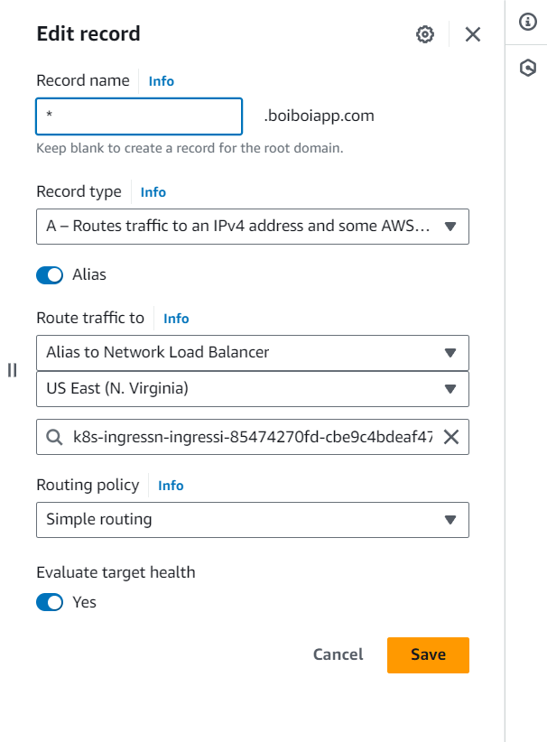

# Deploy on EKS with Terraform

How to run Knot on AWS's EKS with [Terraform](https://www.terraform.io):
```bash
terraform apply # Create the EKS cluster
aws eks --region us-east-1 update-kubeconfig --name tf-cluster # Connect to it
```

You should now be able to run `kubectl get pods -A` and see the cluster's pods with no errors.

Install Knot:
```bash
export KNOT_HOST=example.com # $env:KNOT_HOST="example.com" in Windows
helmfile -f git::https://github.com/CARV-ICS-FORTH/knot.git@helmfile.yaml sync --concurrency 1
```

Now you need to go to Route53's console, create a hosted zone for your DNS name and two records that point to Knot's ingress: `example.com` and `*.example.com`.

The screenshot below shows an example DNS entry.



For each record, make sure that:
- Record type is `A`.
- Alias is on.
- Type is `Alias to Network Load Balancer`.
- Area is `US East (N. Virginia)` (or your preferred region).
- You select Knot's ingress service.

Now wait for the DNS settings to propagate. After a while you should be able to visit Knot in your browser.
