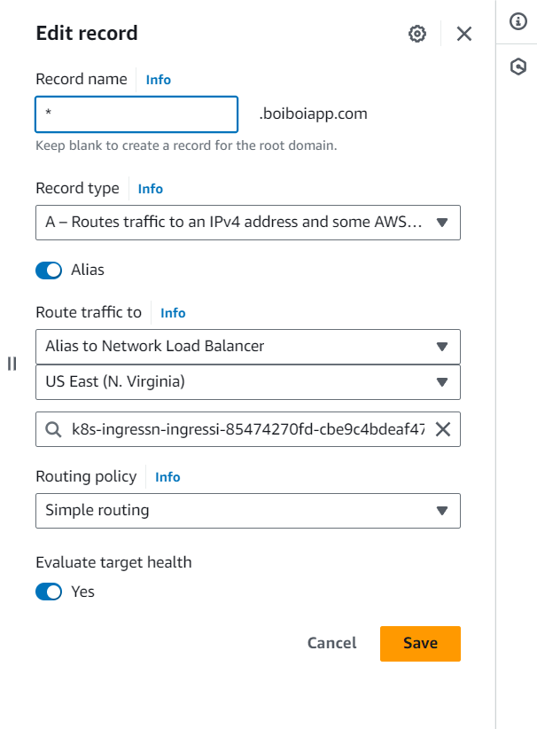

How to run knot on aws:
    - cd into 'eks' folder
    - run 'terraform apply' to create the eks cluster
    - run 'aws eks --region us-east-1 update-kubeconfig --name tf-cluster' in order to connect onto the remote cluster and be able to run commands on it
    - (optional) run 'kubectl get pods -A' to make sure that connected onto the cluster
    - export the KNOT_HOST envirometal as descibed in knot readme ($env:KNOT_HOST="mydns" in windows)
    - cd back onto the folder with knot helmfile
    - run 'helmfile sync --concurrency 1' to deploy knot onto the cluster
        -after running the helmfile make sure that knot ingress is up
    - goto aws route53 console and connect knot ingress to your dns
        - *at the bottom of this read me you'll find details on how to do this*
    - wait for you dns to propagate and after a while you should be able to see knot be pinging you dns
    

*Creating the route53 records
As an example I'm using the custon dns "boiboiapp.com"
 - Create a route53 hosted zone on aws
 - Create records of said route53 in which
    - record type = A
    - alias = on
    - type = Alias to Network Load Balancer
    - area = US East (N. Virginia)
    - Record name = *.boiboiapp.com/boiboiapp.com (create on record for each)
    